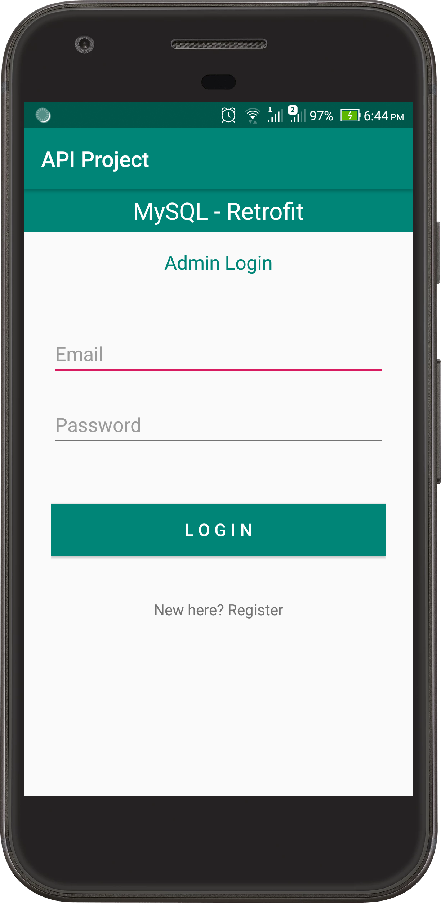
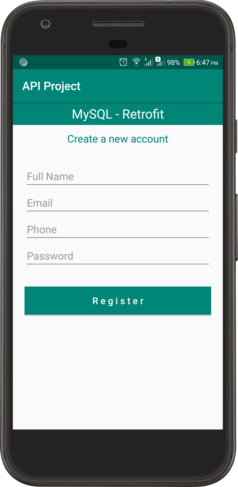
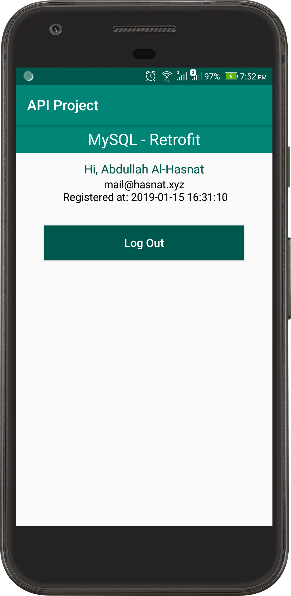

# *Login - Registration through API (PHP-MySQL)*

* Using Fragments instead of Activity
* Retrofit2, Gson
* Using SharedPreference for login status
* Making API with PHP, using MySQL Database

[APIs](https://github.com/TheHasnatBD/REST-API--Android/blob/master/files/api/)
For testing [Download App](https://github.com/TheHasnatBD/REST-API--Android/blob/master/files/app.zip)
#### Some Screenshots of this app
 Login                                   | Register                                    | Home (after login)                        		                    
:---------------------------------------:|:-------------------------------------------:|:-------------------------------------------:
  |   |  

